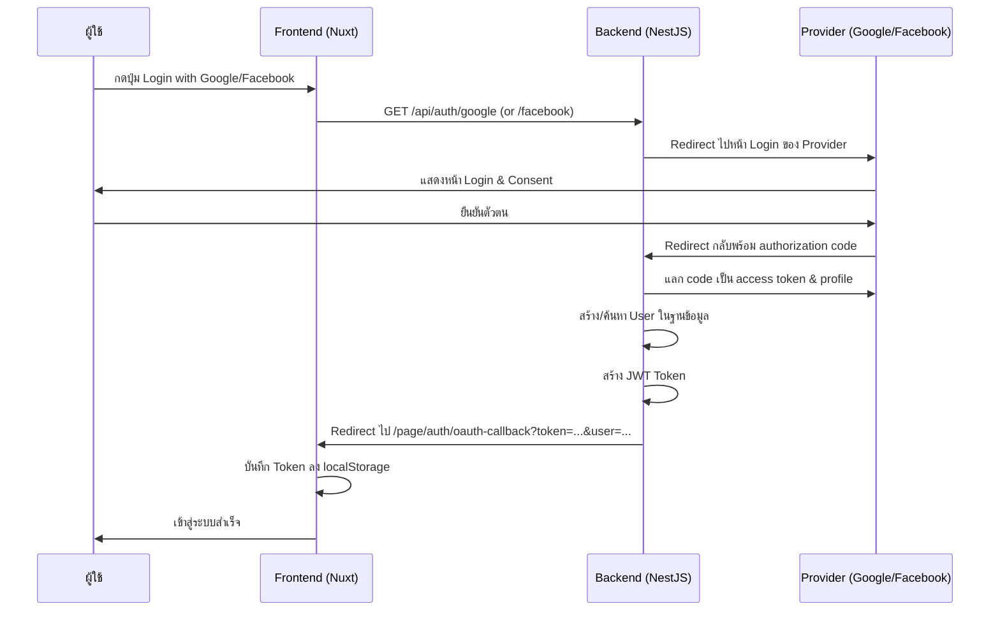
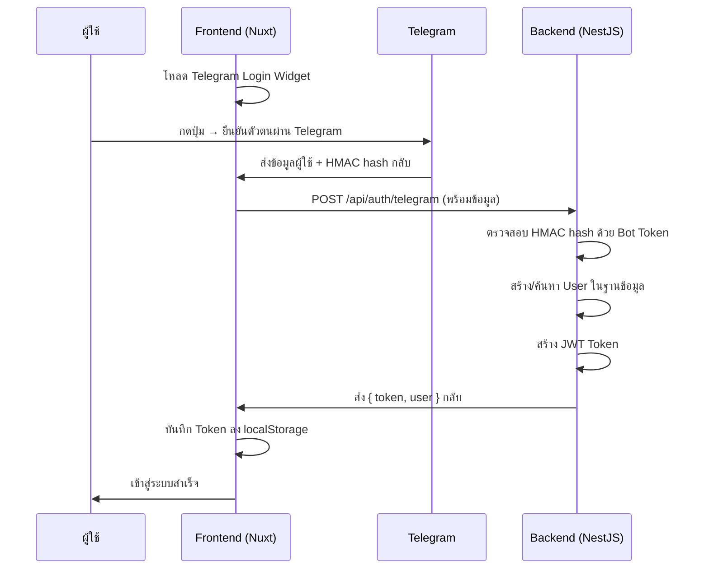

# Nuxt 3 Minimal Starter

Look at the [Nuxt 3 documentation](https://nuxt.com/docs/getting-started/introduction) to learn more.

## Setup

Make sure to install the dependencies:

```bash
# yarn
yarn install

# npm
npm install

# pnpm
pnpm install --shamefully-hoist
```

## Development Server

Start the development server on http://localhost:3000

```bash
npm run dev
```

## Production

Build the application for production:

```bash
npm run build
```

Locally preview production build:

```bash
npm run preview
```

Check out the [deployment documentation](https://nuxt.com/docs/getting-started/deployment) for more information.
# คู่มือการเชื่อมต่อ Google, Facebook และ Telegram Authentication

## สารบัญ
- [ภาพรวมระบบ](#ภาพรวมระบบ)
- [1. Google OAuth](#1-google-oauth)
- [2. Facebook OAuth](#2-facebook-oauth)
- [3. Telegram Login Widget](#3-telegram-login-widget)
- [Environment Variables](#environment-variables)
- [การทำงานของ OAuth Flow](#การทำงานของ-oauth-flow)
- [โครงสร้างไฟล์ที่เกี่ยวข้อง](#โครงสร้างไฟล์ที่เกี่ยวข้อง)

---

## ภาพรวมระบบ

ระบบใช้ **NestJS (Backend)** + **Nuxt 3 (Frontend)** โดยมีรูปแบบการ Login 3 แบบ:

| Provider | วิธีการ | Backend Strategy |
|----------|---------|-----------------|
| Google | OAuth 2.0 (Passport) | `passport-google-oauth20` |
| Facebook | OAuth 2.0 (Passport) | `passport-facebook` |
| Telegram | Login Widget + HMAC verification | ไม่ใช้ Passport (ตรวจสอบ hash เอง) |

---

## 1. Google OAuth

### ขั้นตอนที่ 1: สร้าง Google OAuth Credentials

1. ไปที่ [Google Cloud Console](https://console.cloud.google.com/)
2. สร้าง Project ใหม่ หรือเลือก Project ที่มีอยู่
3. ไปที่ **APIs & Services → Credentials**
4. คลิก **Create Credentials → OAuth client ID**
5. เลือก Application type เป็น **Web application**
6. ตั้งชื่อ เช่น `VizData Auth`
7. กรอกข้อมูล:
   - **Authorized JavaScript origins:**
     ```
     http://localhost:3001        (Backend - Development)
     https://your-backend.com     (Backend - Production)
     ```
   - **Authorized redirect URIs:**
     ```
     http://localhost:3001/api/auth/google/callback    (Development)
     https://your-backend.com/api/auth/google/callback  (Production)
     ```
8. คลิก **Create** แล้วจดบันทึก **Client ID** และ **Client Secret**

### ขั้นตอนที่ 2: เปิดใช้งาน Consent Screen

1. ไปที่ **APIs & Services → OAuth consent screen**
2. เลือก **External** (ถ้าเป็นแอปสาธารณะ)
3. กรอก App name, User support email, Developer contact email
4. เพิ่ม **Scopes**: `email`, `profile`
5. เพิ่ม Test users (ถ้ายังเป็น Testing mode)
6. กด **Publish App** เมื่อพร้อมใช้งานจริง

### ขั้นตอนที่ 3: ตั้งค่า Environment Variables (Backend)

```env
GOOGLE_CLIENT_ID=xxxxxxxxxxxx.apps.googleusercontent.com
GOOGLE_CLIENT_SECRET=GOCSPX-xxxxxxxxxxxxxx
GOOGLE_CALLBACK_URL=http://localhost:3001/api/auth/google/callback
```

### วิธีการทำงาน

```
ผู้ใช้กดปุ่ม "Login with Google"
       ↓
Frontend redirect ไปที่ → GET /api/auth/google
       ↓
Backend (GoogleAuthGuard) redirect ไปที่ Google Login Page
       ↓
ผู้ใช้ Login & ยินยอม (Consent)
       ↓
Google redirect กลับมาที่ → GET /api/auth/google/callback
       ↓
Backend สร้าง/ค้นหา User → สร้าง JWT Token
       ↓
Redirect ไปที่ Frontend → /page/auth/oauth-callback?token=xxx&user=xxx
       ↓
Frontend บันทึก Token & User ลง localStorage → เข้าสู่ระบบสำเร็จ
```

### โค้ดที่เกี่ยวข้อง (Backend)

**Strategy** — `vizdata_project_be/src/auth/strategies/google.strategy.ts`:
```typescript
@Injectable()
export class GoogleStrategy extends PassportStrategy(Strategy, 'google') {
  constructor() {
    super({
      clientID: process.env.GOOGLE_CLIENT_ID,
      clientSecret: process.env.GOOGLE_CLIENT_SECRET,
      callbackURL: process.env.GOOGLE_CALLBACK_URL,
      scope: ['email', 'profile'],
    });
  }

  async validate(accessToken, refreshToken, profile, done) {
    const user = {
      googleId: profile.id,
      email: profile.emails[0].value,
      firstName: profile.name.givenName,
      lastName: profile.name.familyName,
      displayName: profile.displayName,
      picture: profile.photos[0]?.value,
      provider: 'google',
    };
    done(null, user);
  }
}
```

**Controller** — `vizdata_project_be/src/auth/auth.controller.ts`:
```typescript
@Get('google')
@UseGuards(GoogleAuthGuard)
googleAuth() {}

@Get('google/callback')
@UseGuards(GoogleAuthGuard)
async googleAuthCallback(@Req() req, @Res() res) {
  const result = await this.authService.oAuthLogin(req.user);
  const frontendUrl = process.env.FRONTEND_URL || 'http://localhost:3000';
  res.redirect(`${frontendUrl}/page/auth/oauth-callback?token=${result.token}&user=${encodeURIComponent(JSON.stringify(result.user))}`);
}
```

### โค้ดที่เกี่ยวข้อง (Frontend)

**หน้า Login** — `vizdataproject/pages/page/auth/AuthLogin.vue`:
```javascript
const loginWithGoogle = () => {
  window.location.href = `${apiUrl}/api/auth/google`;
};
```

---

## 2. Facebook OAuth

### ขั้นตอนที่ 1: สร้าง Facebook App

1. ไปที่ [Facebook Developers](https://developers.facebook.com/)
2. คลิก **My Apps → Create App**
3. เลือก **Consumer** หรือ **Business** (แล้วแต่กรณี)
4. ตั้งชื่อ App เช่น `VizData Login`
5. ในหน้า Dashboard ไปที่ **Add Products → Facebook Login → Set Up**
6. เลือก **Web**

### ขั้นตอนที่ 2: ตั้งค่า Facebook Login

1. ไปที่ **Facebook Login → Settings**
2. กรอก **Valid OAuth Redirect URIs:**
   ```
   http://localhost:3001/api/auth/facebook/callback    (Development)
   https://your-backend.com/api/auth/facebook/callback  (Production)
   ```
3. เปิดใช้งาน:
   - ✅ Client OAuth Login
   - ✅ Web OAuth Login
4. ไปที่ **Settings → Basic** เพื่อดู **App ID** และ **App Secret**

### ขั้นตอนที่ 3: ตั้งค่า Advanced (สำคัญ)

1. ไปที่ **App Review → Permissions and Features**
2. ขอสิทธิ์ `email` (ปกติได้ทันทีสำหรับ Development)
3. สำหรับ Production: ต้องส่ง App Review เพื่อขอ `email` permission

### ขั้นตอนที่ 4: ตั้งค่า Environment Variables (Backend)

```env
FACEBOOK_APP_ID=123456789012345
FACEBOOK_APP_SECRET=abcdef1234567890abcdef1234567890
FACEBOOK_CALLBACK_URL=http://localhost:3001/api/auth/facebook/callback
```

### วิธีการทำงาน

```
ผู้ใช้กดปุ่ม "Login with Facebook"
       ↓
Frontend redirect ไปที่ → GET /api/auth/facebook
       ↓
Backend (FacebookAuthGuard) redirect ไปที่ Facebook Login Page
       ↓
ผู้ใช้ Login & ยินยอม
       ↓
Facebook redirect กลับมาที่ → GET /api/auth/facebook/callback
       ↓
Backend สร้าง/ค้นหา User → สร้าง JWT Token
       ↓
Redirect ไปที่ Frontend → /page/auth/oauth-callback?token=xxx&user=xxx
       ↓
Frontend บันทึก Token & User ลง localStorage → เข้าสู่ระบบสำเร็จ
```

### โค้ดที่เกี่ยวข้อง (Backend)

**Strategy** — `vizdata_project_be/src/auth/strategies/facebook.strategy.ts`:
```typescript
@Injectable()
export class FacebookStrategy extends PassportStrategy(Strategy, 'facebook') {
  constructor() {
    super({
      clientID: process.env.FACEBOOK_APP_ID,
      clientSecret: process.env.FACEBOOK_APP_SECRET,
      callbackURL: process.env.FACEBOOK_CALLBACK_URL,
      profileFields: ['id', 'emails', 'name', 'displayName', 'photos'],
      scope: ['email'],
    });
  }

  async validate(accessToken, refreshToken, profile, done) {
    const user = {
      facebookId: profile.id,
      email: profile.emails?.[0]?.value,
      firstName: profile.name?.givenName,
      lastName: profile.name?.familyName,
      displayName: profile.displayName,
      picture: profile.photos?.[0]?.value,
      provider: 'facebook',
    };
    done(null, user);
  }
}
```

**Controller** — `vizdata_project_be/src/auth/auth.controller.ts`:
```typescript
@Get('facebook')
@UseGuards(FacebookAuthGuard)
facebookAuth() {}

@Get('facebook/callback')
@UseGuards(FacebookAuthGuard)
async facebookAuthCallback(@Req() req, @Res() res) {
  const result = await this.authService.oAuthLogin(req.user);
  const frontendUrl = process.env.FRONTEND_URL || 'http://localhost:3000';
  res.redirect(`${frontendUrl}/page/auth/oauth-callback?token=${result.token}&user=${encodeURIComponent(JSON.stringify(result.user))}`);
}
```

### โค้ดที่เกี่ยวข้อง (Frontend)

```javascript
const loginWithFacebook = () => {
  window.location.href = `${apiUrl}/api/auth/facebook`;
};
```

---

## 3. Telegram Login Widget

### ขั้นตอนที่ 1: สร้าง Telegram Bot

1. เปิด Telegram แล้วค้นหา **@BotFather**
2. พิมพ์ `/newbot`
3. ตั้งชื่อ Bot เช่น `VizData Shop Bot`
4. ตั้ง Username เช่น `BDNShopBot`
5. จดบันทึก **Bot Token** ที่ BotFather ให้มา (เช่น `123456789:ABCdefGhIJKlmNoPQRsTUVwxyz`)

### ขั้นตอนที่ 2: ตั้งค่า Login Widget Domain

1. พิมพ์ `/setdomain` ให้ @BotFather
2. เลือก Bot ที่สร้าง
3. ใส่ Domain ที่จะใช้ Login Widget:
   ```
   localhost                (Development)
   your-frontend.com        (Production)
   ```
   > **หมายเหตุ:** Telegram Login Widget ต้องใช้ HTTPS ใน Production  
   > สำหรับ Development บน localhost จะใช้ HTTP ได้

### ขั้นตอนที่ 3: ตั้งค่า Environment Variables

**Backend (.env):**
```env
TELEGRAM_BOT_TOKEN=123456789:ABCdefGhIJKlmNoPQRsTUVwxyz
```

**Frontend (.env):**
```env
NUXT_PUBLIC_TELEGRAM_BOT_NAME=BDNShopBot
```

### วิธีการทำงาน

Telegram ใช้วิธีที่แตกต่างจาก Google/Facebook — ไม่มี redirect ไป Telegram แล้วกลับมา แต่ใช้ **Login Widget** ที่ฝังอยู่ในหน้า Login โดยตรง:

```
หน้า Login โหลด Telegram Login Widget (ปุ่ม "Login with Telegram")
       ↓
ผู้ใช้กดปุ่ม → Popup ของ Telegram เปิดขึ้น
       ↓
ผู้ใช้ยืนยันตัวตนผ่าน Telegram App / QR Code
       ↓
Telegram ส่งข้อมูลกลับมาที่ callback function ใน Frontend
       ↓
Frontend ส่ง POST /api/auth/telegram พร้อมข้อมูล:
  { id, first_name, last_name, username, photo_url, auth_date, hash }
       ↓
Backend ตรวจสอบ HMAC-SHA256 hash ด้วย Bot Token
       ↓
ถ้า hash ถูกต้อง → สร้าง/ค้นหา User → สร้าง JWT Token → ส่งกลับ
       ↓
Frontend บันทึก Token & User → เข้าสู่ระบบสำเร็จ
```

### การตรวจสอบความปลอดภัย (HMAC Verification)

Backend ใช้วิธีตรวจสอบตาม [Telegram Official Docs](https://core.telegram.org/widgets/login#checking-authorization):

1. สร้าง `secret_key` = SHA256(BOT_TOKEN)
2. สร้าง `data_check_string` จากข้อมูลทั้งหมด (ยกเว้น hash) เรียงตามตัวอักษร คั่นด้วย `\n`
3. คำนวณ HMAC-SHA256(data_check_string, secret_key)
4. เปรียบเทียบกับ hash ที่ได้รับ
5. ตรวจสอบ `auth_date` ไม่เกิน 24 ชั่วโมง

### โค้ดที่เกี่ยวข้อง (Backend)

**Service** — `vizdata_project_be/src/auth/auth.service.ts`:
```typescript
async telegramLogin(telegramData: any) {
  const botToken = process.env.TELEGRAM_BOT_TOKEN;
  const { hash, ...data } = telegramData;

  // สร้าง data_check_string
  const dataCheckArr = Object.keys(data)
    .sort()
    .map(key => `${key}=${data[key]}`);
  const dataCheckString = dataCheckArr.join('\n');

  // สร้าง secret key จาก bot token
  const secretKey = crypto.createHash('sha256').update(botToken).digest();

  // ตรวจสอบ HMAC
  const hmac = crypto.createHmac('sha256', secretKey)
    .update(dataCheckString)
    .digest('hex');

  if (hmac !== hash) {
    throw new UnauthorizedException('Invalid Telegram data');
  }

  // ตรวจสอบว่าไม่เกิน 24 ชั่วโมง
  const authDate = parseInt(data.auth_date);
  const now = Math.floor(Date.now() / 1000);
  if (now - authDate > 86400) {
    throw new UnauthorizedException('Telegram auth data expired');
  }

  // สร้าง user object แล้วเข้าสู่ระบบ
  const user = {
    telegramId: data.id.toString(),
    firstName: data.first_name,
    lastName: data.last_name || '',
    username: data.username,
    picture: data.photo_url,
    provider: 'telegram',
  };

  return this.oAuthLogin(user);
}
```

**Controller:**
```typescript
@Post('telegram')
async telegramLogin(@Body() telegramData: any) {
  return this.authService.telegramLogin(telegramData);
}
```

### โค้ดที่เกี่ยวข้อง (Frontend)

**หน้า Login** — `vizdataproject/pages/page/auth/AuthLogin.vue`:
```javascript
// โหลด Telegram Login Widget
const loadTelegramWidget = () => {
  const botName = useRuntimeConfig().public.TELEGRAM_BOT_NAME || 'BDNShopBot';
  const script = document.createElement('script');
  script.src = 'https://telegram.org/js/telegram-widget.js?22';
  script.setAttribute('data-telegram-login', botName);
  script.setAttribute('data-size', 'large');
  script.setAttribute('data-radius', '8');
  script.setAttribute('data-onauth', 'onTelegramAuth(user)');
  script.setAttribute('data-request-access', 'write');
  document.getElementById('telegram-login-container').appendChild(script);
};

// Callback เมื่อ Telegram ส่งข้อมูลกลับ
window.onTelegramAuth = async (user) => {
  const response = await $fetch(`${apiUrl}/api/auth/telegram`, {
    method: 'POST',
    body: user,
  });
  authStore.loginWithOAuth(response.user, response.token);
};
```

---

## Environment Variables

### สรุป ENV ทั้งหมดที่ต้องตั้งค่า

#### Backend (`vizdata_project_be/.env`)

```env
# JWT
JWT_SECRET=your-super-secret-jwt-key

# Frontend URL (สำหรับ OAuth redirect)
FRONTEND_URL=http://localhost:3000

# Google OAuth
GOOGLE_CLIENT_ID=xxxxxxxxxxxx.apps.googleusercontent.com
GOOGLE_CLIENT_SECRET=GOCSPX-xxxxxxxxxxxxxx
GOOGLE_CALLBACK_URL=http://localhost:3001/api/auth/google/callback

# Facebook OAuth
FACEBOOK_APP_ID=123456789012345
FACEBOOK_APP_SECRET=abcdef1234567890abcdef1234567890
FACEBOOK_CALLBACK_URL=http://localhost:3001/api/auth/facebook/callback

# Telegram
TELEGRAM_BOT_TOKEN=123456789:ABCdefGhIJKlmNoPQRsTUVwxyz
```

#### Frontend (`vizdataproject/.env`)

```env
# Backend API URL
NUXT_PUBLIC_API_URL=http://localhost:3001

# Telegram Bot Name
NUXT_PUBLIC_TELEGRAM_BOT_NAME=BDNShopBot
```

---

## การทำงานของ OAuth Flow

### Google & Facebook (Redirect Flow)



### Telegram (Widget Flow)



---

## โครงสร้างไฟล์ที่เกี่ยวข้อง

```
vizdata_project_be/                         # Backend (NestJS)
├── src/auth/
│   ├── auth.module.ts                      # ลงทะเบียน Strategies ทั้งหมด
│   ├── auth.controller.ts                  # Route endpoints (/auth/google, /facebook, /telegram)
│   ├── auth.service.ts                     # Logic: oAuthLogin(), telegramLogin()
│   ├── guards/
│   │   ├── jwt-auth.guard.ts               # JWT Guard
│   │   ├── google-auth.guard.ts            # Google OAuth Guard
│   │   └── facebook-auth.guard.ts          # Facebook OAuth Guard
│   └── strategies/
│       ├── jwt.strategy.ts                 # JWT verification strategy
│       ├── google.strategy.ts              # Google OAuth strategy
│       └── facebook.strategy.ts            # Facebook OAuth strategy

vizdataproject/                              # Frontend (Nuxt 3)
├── pages/page/auth/
│   ├── AuthLogin.vue                       # หน้า Login (ปุ่ม Google/Facebook/Telegram)
│   └── oauth-callback.vue                  # รับ Token จาก OAuth redirect
├── store/auth.js                           # Pinia store จัดการ auth state
├── services/authService.ts                 # API client สำหรับ auth
├── middleware/auth.js                       # Route guard ตรวจสอบสิทธิ์
└── nuxt.config.ts                          # Config: TELEGRAM_BOT_NAME, API_URL
```

---

## แพ็คเกจที่ต้องติดตั้ง (Backend)

```bash
npm install @nestjs/passport passport
npm install passport-google-oauth20
npm install passport-facebook
npm install @types/passport-google-oauth20 @types/passport-facebook --save-dev
```

> Telegram ไม่ต้องติดตั้งแพ็คเกจเพิ่ม ใช้ `crypto` module ของ Node.js ที่มีอยู่แล้ว

---

## Troubleshooting

| ปัญหา | สาเหตุ | วิธีแก้ |
|--------|--------|---------|
| Google: `redirect_uri_mismatch` | Callback URL ไม่ตรงกับที่ตั้งใน Google Console | ตรวจสอบ `GOOGLE_CALLBACK_URL` ให้ตรงกัน |
| Facebook: `URL Blocked` | Domain ไม่ได้ลงทะเบียนใน Facebook App | เพิ่ม domain ใน Facebook Login Settings |
| Facebook: ไม่ได้ email | ผู้ใช้ไม่ได้ให้สิทธิ์ email | ตรวจสอบ scope และ profileFields |
| Telegram: `Invalid Telegram data` | Hash ไม่ตรง | ตรวจสอบ `TELEGRAM_BOT_TOKEN` ให้ถูกต้อง |
| Telegram: `auth data expired` | auth_date เกิน 24 ชม. | ให้ผู้ใช้กด Login ใหม่ |
| Telegram Widget ไม่แสดง | Domain ไม่ได้ตั้งค่าใน BotFather | ใช้ `/setdomain` ตั้งค่าใน BotFather |
| OAuth redirect ไป localhost ใน Production | `FRONTEND_URL` ยังเป็น localhost | ตั้งค่า `FRONTEND_URL` ให้เป็น Production URL |
